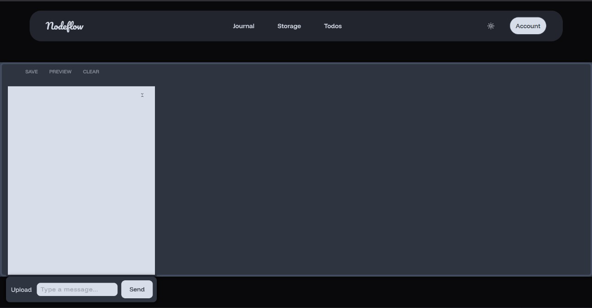

## NodeFlow, Simple local file sharing and collaborative editing

NodeFlow is a locally-hosted web application that helps in file sharing and collaborative live text editing in local network.


## Table of Contents

1. [ Features](#features)
2. [Tech Stack](#tech-stack)
3. [Getting Started](#to-get-started)

4. [Demo ](#demo-link)
5. [Future Developments](#future-developments)

### ✨ Features

NodeFlow is a comprehensive, locally-hosted file sharing and dynamic text editing.

- local file sharing and texting  within your network.

- Offline-first design ensures continuous access to your data, even without an internet connection.

- # Lightweight and customizable for efficient performance on a variety of devices.
  
  

## Tech Stack

### Frontend


### Backend


## To Get Started

### Prerequisites

- bun

#### 1. Clone the Repository

```bash
git clone https://github.com/bharathkrishna0/Nodeflow.git

```

#### 2. Setup Frontend

```bash
cd frontend # Or the directory where your frontend code is located
bun install   # Install frontend dependencies (if not already done)
bun run build    # build the frontend code

```

#### 2. Setup Backend

```bash
bun install   # Install frontend dependencies (if not already done)
bun run dev    # build the frontend code

```

## Demo link:
https://drive.google.com/drive/folders/1aEhL5zftN20UiFuGlpvTRNyPnx2Ih_3Y?usp=sharing

### Roadmap

### Future Developments

- Collaborative Task Lists: Enable multiple users on the local network
- acessing files in host device

## Project Structure

The project is organized into several key directories and files:

### Key Directories and Files


### Contributing

We welcome contributions to improve NodeFlow!

If you'd like to contribute, please read the contributing guide here : [Contributing.md](https://github.com/bharathkrishna0/Nodeflow/main/Contributing.md)
and follow the [Code_of_conduct.md](https://github.com/bharathkrishna0/Nodeflow/main/Code_of_conduct.md)

## License

# This project is licensed under the MIT License. See the [LICENSE](LICENSE) file for more details.
