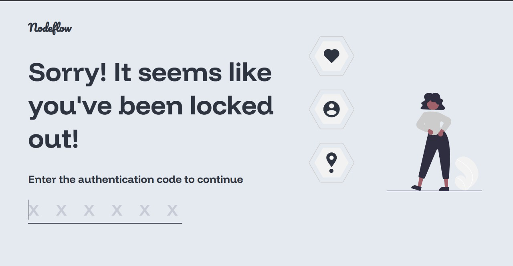
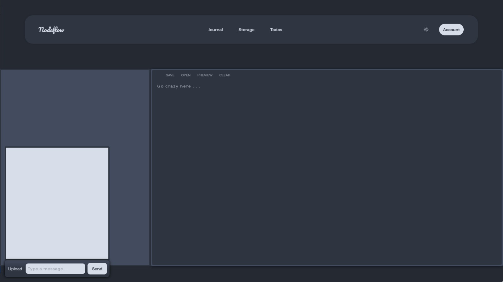
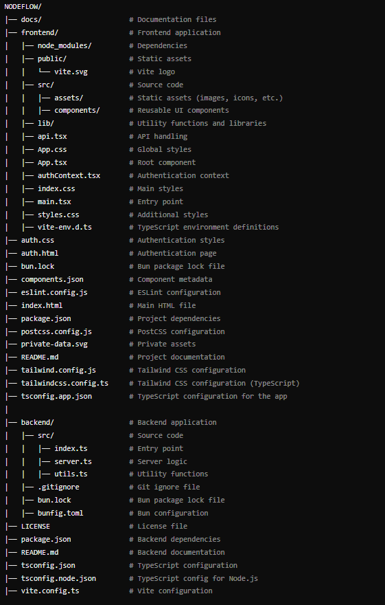

## NodeFlow, Simple & Open Source Notion Alternative


NodeFlow is a locally-hosted web application that centralizes personal management tasks like scheduling, finances, and file sharing, enhancing privacy and control without relying on the internet.





## Table of Contents
1. [ Features](#features)
2. [Tech Stack](#tech-stack)
3. [Getting Started](#to-get-started)

4. [Demo ](#demo-link)
5. [Future Developments](#future-developments)


### ✨ Features
 NodeFlow is a comprehensive, locally-hosted personal management system.

* Centralized dashboard for scheduling, finances, sleep tracking, workouts, and more.

* Secure local file sharing and texting for enhanced privacy and control within your network.

* Offline-first design ensures continuous access to your data, even without an internet connection.

* Lightweight and customizable for efficient performance on a variety of devices.



## Tech Stack

### Frontend


### Backend


##  To Get Started

### Prerequisites

- Node.js (v14 or higher)
- .NET SDK (v5.0 or higher)
- react==18.2.0
- react-dom==18.2.0
- @types/react==18.2.0
- @types/react-dom==18.2.0
- @vitejs/plugin-react==4.0.3
- typescript==5.0.2
- vite==4.4.5

#### 1. Clone the Repository

```bash
git clone https://github.com/bharathkrishna0/Nodeflow.git

```
#### 2. Setup Frontend 

```bash
cd frontend # Or the directory where your frontend code is located
bun install   # Install frontend dependencies (if not already done)
bun run dev     # Start the Vite development server. You may need to check the `package.json` to ensure that there is a `dev` file

```


## Demo link:


### Future Developments

* AI-Powered System Intergration
* NodeFlow Platform: For developers to build and share custom modules
* Collaborative Task Lists: Enable multiple users on the local network 


## Project Structure

The project is organized into several key directories and files:

### Key Directories and Files




### Contributing

We welcome contributions to improve NodeFlow!

 If you'd like to contribute, please  read the contributing guide here : [Contributing.md](https://github.com/bharathkrishna0/Nodeflow/main/Contributing.md)
and  follow the [Code_of_conduct.md](https://github.com/bharathkrishna0/Nodeflow/main/Code_of_conduct.md)


## License

This project is licensed under the MIT License. See the [LICENSE](LICENSE) file for more details.


